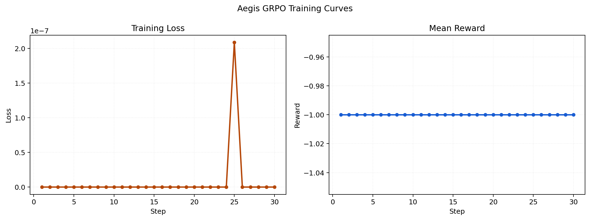
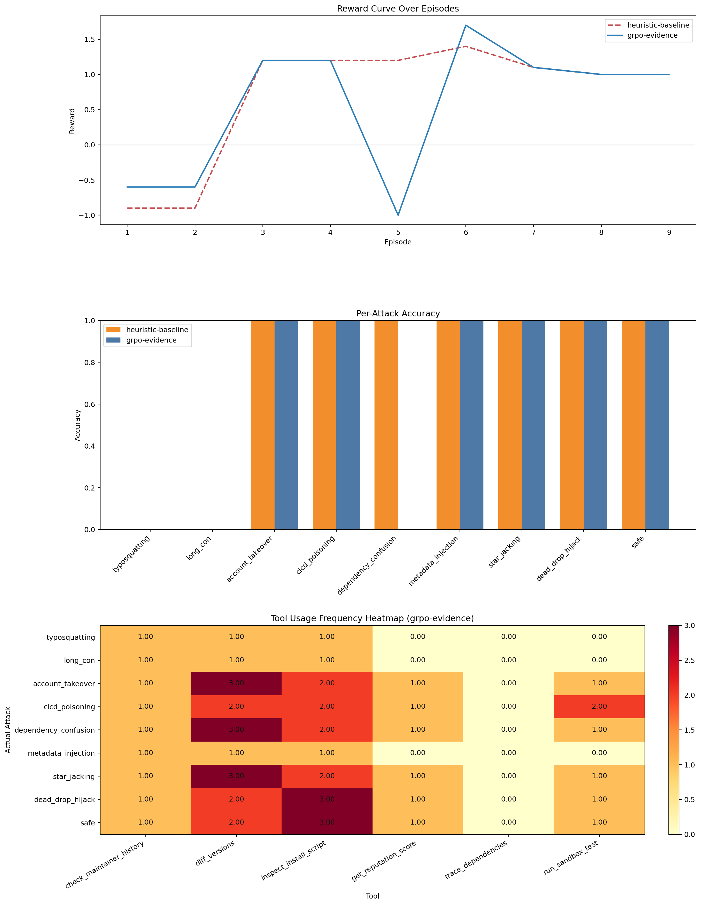

# Aegis-Env

In March 2026, a simulated incident rattles two teams:

- Claude’s on-call security engineer is paged for suspicious package installs.
- Vercel’s customer success inbox starts filling with “our build pulled malware” escalations.

The failure mode is familiar: an LLM assistant can _talk_ about supply-chain attacks, but it cannot reliably **run a tool-driven investigation**, keep state, and communicate **calm, actionable guidance** to stakeholders under uncertainty.

**Aegis-Env** is an OpenEnv MCP environment for training LLM agents on realistic package supply-chain forensics. Each episode hides one attack in a synthetic package ecosystem; the agent must gather evidence through tools, maintain state across steps, and submit a final attack verdict — while optionally maintaining a long-horizon case file and replying to stakeholder messages.

Built against **OpenEnv Core `openenv-core==0.2.3`** (pinned in `pyproject.toml` under the `openenv` extra).

This repository is aligned to **Theme 3.1 (World Modeling - Professional Tasks)** of the OpenEnv Hackathon. The core task is a professional security workflow in a partially observable world: the agent must interrogate tool outputs, update its beliefs, and end with a single high-stakes classification.

Additional themes supported:

- **Theme 3.2 (Personalized Tasks)**: a lightweight “stakeholder inbox” requires context-aware incident updates (`aegis://inbox/current`, `draft_incident_reply`, `send_incident_reply`).
- **Theme 2 (Long-Horizon Planning & Instruction Following)**: a persistent case file encourages durable state across longer trajectories (`aegis://casefile/current`, `append_case_note`).

## Problem Statement

Modern coding agents fail on real-world supply-chain incidents because they:

1. Underuse available tools.
2. Jump to verdicts without complete evidence.
3. Lose consistency between observed signals and final reasoning.

Aegis-Env trains those capabilities in a partially observable world with delayed terminal decisions and compositional reward signals.

## Minimum Requirement Status

- OpenEnv environment: yes. Manifest in [openenv.yaml](openenv.yaml), server in [environment/mcp_server.py](environment/mcp_server.py), and shared runtime in [environment/runtime.py](environment/runtime.py). OpenEnv dependency is pinned as `openenv-core==0.2.3` in `pyproject.toml` (`.[openenv]`).
- Working TRL training script: yes. Entrypoint [training/train.py](training/train.py), GRPO implementation in [training/grpo.py](training/grpo.py), and a re-runnable Colab notebook in [notebooks/aegis_grpo_colab.ipynb](notebooks/aegis_grpo_colab.ipynb).
- Real training evidence with loss and reward plots: yes. See [reports/training_evidence/training_summary.json](reports/training_evidence/training_summary.json), [reports/training_evidence/training_log_history.json](reports/training_evidence/training_log_history.json), and [reports/training_evidence/training_curves.png](reports/training_evidence/training_curves.png).
- Short presentation asset linked from the README: yes. See [docs/hackathon_slide_deck.md](docs/hackathon_slide_deck.md).
- Hugging Face Space packaging: yes. The app is Docker Space-ready via [docker/Dockerfile](docker/Dockerfile) and [docker/demo.py](docker/demo.py).
- Live Hugging Face Space URL: yes. https://huggingface.co/spaces/userAdityaaaa/aegis

## Quickstart

1. Install the repo:

```bash
pip install -e .[openenv,server,eval,demo,training]
```

2. Run the local demo:

```bash
python docker/demo.py --server-name 127.0.0.1 --server-port 7860
```

3. Regenerate the hackathon evidence bundle (updates `submission_checks` in [reports/hackathon/submission_summary.json](reports/hackathon/submission_summary.json), including the live Space URL from this README):

```bash
python -m eval.hackathon --episodes-per-attack 1 --seed 0 --output-dir reports/hackathon
```

For a slightly thicker evaluation (same workflow, more episodes per attack class), use `--episodes-per-attack 2` or higher.

## Why This Environment Is Novel

1. **Tool-grounded forensic world**: agents must use realistic investigation tools, not just emit labels.
2. **Partially observable dynamics**: the ground-truth attack is hidden; only traces and metadata are exposed.
3. **Attack diversity**: 8 malicious classes plus safe episodes (typosquatting, dependency confusion, CI/CD poisoning, and more).
4. **Anti-gaming reward shaping**: reward combines accuracy, false-alarm control, parsimony, evidence-tool coverage, reasoning hints, and a small bonus for incident-communication + case-file hygiene.
5. **Stakeholder-facing realism**: the agent is rewarded for producing usable updates, not just correct labels.

## Results Snapshot

**How to read the results below:**

- **Random** and **heuristic** are policy baselines.
- The default **“trained”** row in the hackathon bundle is **not** a neural LLM by default — it is a **nearest-neighbor classifier** over handcrafted forensic features ([`artifacts/classifier-smoke/policy.json`](artifacts/classifier-smoke/policy.json)). This is a fast, deterministic benchmark used for quick comparisons.
- If you want **TRL / GRPO transformer checkpoint** metrics, regenerate the hackathon bundle with `--trained-model <checkpoint_dir>` and provide `--trained-label ...`. In that mode, the bundle will explicitly mark `trained_policy.kind=transformer_checkpoint` in `reports/hackathon/submission_summary.json`.

Current source of truth: [reports/hackathon/submission_summary.json](reports/hackathon/submission_summary.json)

- Random baseline: 22.2% accuracy, -0.32 average reward, 2.0 average steps.
- Heuristic baseline: 77.8% accuracy, 0.70 average reward, 6.0 average steps.
- **Trained (non-neural) classifier policy**: 88.9% accuracy, 0.92 average reward, 6.0 average steps.
- Heuristic -> trained delta: +11.1 accuracy points and +0.22 average reward.
- Random -> trained delta: +66.7 accuracy points and +1.24 average reward.

The default **trained** line in [reports/hackathon/submission_summary.json](reports/hackathon/submission_summary.json) comes from the lightweight nearest-neighbor forensic policy artifact in [artifacts/classifier-smoke/policy.json](artifacts/classifier-smoke/policy.json).

Important: the default `trained` in the hackathon bundle is **not** the TRL/GRPO transformer checkpoint — it is the lightweight **nearest-neighbor classifier** (`artifacts/classifier-smoke/policy.json`) used as a fast, deterministic benchmark. If your story/pitch is “we trained with TRL”, use the transformer checkpoint evaluation path below and cite the corresponding trained report.

**Training evidence sanity target (what “good” looks like):**

- `tools/call_frequency` should be **> 0.0**
- `aegis/verdict_completion_rate` should be **> 0.0**
- `aegis/reward_mean` should be **not flat at -1.0**

These are automatically summarized under `submission_checks` when you regenerate the hackathon bundle (see `reports/hackathon/submission_summary.json`).





## OpenEnv Compliance Snapshot

1. Manifest: [openenv.yaml](openenv.yaml)
2. MCP server runtime: [environment/mcp_server.py](environment/mcp_server.py)
3. Shared non-server runtime (client/server separation): [environment/runtime.py](environment/runtime.py)
4. Gym-like episode flow: reset/start, step via tools, terminal verdict.
5. Reserved tool names avoided (`reset`, `step`, `state`, and `close` are not used as tool names).
6. Additional resources/tools for Theme 3.2 + long-horizon: `aegis://inbox/current`, `aegis://casefile/current`, `append_case_note`, `draft_incident_reply`, `send_incident_reply`.

## Using OpenEnv

- **Manifest**: `openenv.yaml` is the OpenEnv discovery surface (resources + tools + workflow).
- **Serving (MCP runtime)**: `environment/mcp_server.py` serves the environment over MCP using `FastMCP`. OpenEnv environments are evaluated via the MCP contract exposed by the manifest; we keep the server implementation lightweight and manifest-driven rather than subclassing an OpenEnv-specific server base class.
- **Deployment**: the repo is Docker Space-ready; deploy to Hugging Face Spaces and link the live Space URL in **Submission Assets**.
- **Version**: OpenEnv Core is pinned as `openenv-core==0.2.3` (see `pyproject.toml` → `.[openenv]`).

## Reward Design

[rewards/scoring.py](rewards/scoring.py) combines:

This environment uses OpenEnv-style **composable rubrics** (not a single monolithic reward).

The final reward is the sum of four named sub-rubrics:

1. **VerdictRubric**: \(+1.0\) correct, \(-1.0\) incorrect
2. **SpeedRubric**: up to \(+0.3\) bonus for concise investigations
3. **SpecificityRubric**: \(-0.6\) penalty for false quarantines (safe → non-safe)
4. **EvidenceRubric**: \(+0.1\) per unique evidence signal cited in reasoning

These are implemented as OpenEnv `Rubric` subclasses in `rewards/rubrics.py` and composed by `rewards/scoring.py`.

This makes it harder for agents to exploit shallow strategies such as guessing without collecting attack-specific evidence.

## Training Pipeline (TRL + Colab)

Minimal training entrypoint:

- [training/train.py](training/train.py)

Re-runnable Colab notebook:

- [notebooks/aegis_grpo_colab.ipynb](notebooks/aegis_grpo_colab.ipynb)

Recommended GRPO run that writes **fresh** training evidence (run in **Colab with GPU**; `sshleifer/tiny-gpt2` is not recommended here because tool-augmented prompts can exceed its short context):

```bash
python -m training.train \
	--train \
	--model-name Qwen/Qwen3-0.6B \
	--episodes-per-attack 1 \
	--max-steps 20 \
	--per-device-train-batch-size 2 \
	--gradient-accumulation-steps 1 \
	--num-generations 2 \
	--max-completion-length 256 \
	--max-tool-calling-iterations 7 \
	--logging-steps 1 \
	--save-steps 20 \
	--output-dir artifacts/grpo-evidence \
	--evidence-dir reports/training_evidence \
	--run-name aegis-grpo-evidence
```

**Note on GRPO logs:** Training uses two reward terms: the environment rubric (`aegis_reward_func`) plus a small **completion-shaping** term (`aegis_completion_reward_func` in `training/grpo_env.py`) so short smoke runs still get a non-degenerate learning signal when the model fails to execute tools. For a convincing curve, run enough steps on GPU and commit the updated `reports/training_evidence/` files.

Committed training evidence (regenerate in Colab after training):

1. [reports/training_evidence/training_summary.json](reports/training_evidence/training_summary.json)
2. [reports/training_evidence/training_log_history.json](reports/training_evidence/training_log_history.json)
3. [reports/training_evidence/training_curves.png](reports/training_evidence/training_curves.png)

Additional research-grade evidence (generated when training writes `per_episode_events.jsonl`):

1. `rubric_components.png` (per-rubric score curves)
2. `per_class_accuracy.png` (one curve per attack class)
3. `confusion_matrix.png` (from per-episode logs)
4. `transcript_viewer.html` (side-by-side transcript demo)

Additional transformer smoke artifacts:

1. [reports/sft_smoke/training_summary.json](reports/sft_smoke/training_summary.json)
2. [reports/sft_smoke/trained_report.json](reports/sft_smoke/trained_report.json)
3. [reports/sft_smoke_compact/training_summary.json](reports/sft_smoke_compact/training_summary.json)

## Evaluation And Improvement Evidence

Single-command hackathon evidence bundle:

```bash
python -m eval.hackathon --episodes-per-attack 1 --seed 0 --output-dir reports/hackathon
```

By default, this command trains or reuses [artifacts/classifier-smoke/policy.json](artifacts/classifier-smoke/policy.json) and evaluates it as the trained policy.

Optional transformer-checkpoint evaluation path (use this for “TRL-trained model” results):

```bash
python -m eval.hackathon \
	--episodes-per-attack 1 \
	--seed 0 \
	--output-dir reports/hackathon \
	--trained-model artifacts/grpo-evidence \
	--trained-label grpo-evidence
```

Optional comparison against the committed transformer smoke report:

```bash
python -m eval.hackathon \
	--episodes-per-attack 1 \
	--seed 0 \
	--output-dir reports/hackathon \
	--trained-report reports/sft_smoke/trained_report.json
```

Generated bundle includes:

1. [reports/hackathon/random_report.json](reports/hackathon/random_report.json)
2. [reports/hackathon/heuristic_report.json](reports/hackathon/heuristic_report.json)
3. [reports/hackathon/trained_report.json](reports/hackathon/trained_report.json)
4. [reports/hackathon/random_vs_heuristic.json](reports/hackathon/random_vs_heuristic.json)
5. [reports/hackathon/heuristic_vs_trained.json](reports/hackathon/heuristic_vs_trained.json)
6. [reports/hackathon/random_vs_trained.json](reports/hackathon/random_vs_trained.json)
7. [reports/hackathon/submission_summary.json](reports/hackathon/submission_summary.json)

Use [reports/hackathon/submission_summary.json](reports/hackathon/submission_summary.json) as the source of truth for current metrics and compliance checks.

## Install

```bash
pip install -e .[openenv,server,eval,demo,training]
```

CLI entrypoints:

1. `aegis-env-mcp`
2. `aegis-env-fit-classifier`
3. `aegis-env-train`
4. `aegis-env-eval`
5. `aegis-env-compare`
6. `aegis-env-hackathon`

## Run Demo

```bash
python docker/demo.py --server-name 127.0.0.1 --server-port 7860
```

## Docker / Hugging Face Space

Build locally:

```bash
docker build -t aegis-env .
```

Run demo mode:

```bash
docker run --rm -p 7860:7860 aegis-env
```

Run MCP mode:

```bash
docker run --rm -e AEGIS_APP_MODE=mcp aegis-env
```

For Hugging Face Spaces, set `sdk: docker` in the README frontmatter. The root `Dockerfile` is used automatically. The container entrypoint supports both demo mode and MCP mode.

## Submission Assets

- Environment manifest: [openenv.yaml](openenv.yaml)
- MCP server: [environment/mcp_server.py](environment/mcp_server.py)
- Colab notebook: [notebooks/aegis_grpo_colab.ipynb](notebooks/aegis_grpo_colab.ipynb)
- Training evidence bundle: [reports/training_evidence/training_summary.json](reports/training_evidence/training_summary.json), [reports/training_evidence/training_log_history.json](reports/training_evidence/training_log_history.json), [reports/training_evidence/training_curves.png](reports/training_evidence/training_curves.png)
- Hackathon evaluation bundle: [reports/hackathon/submission_summary.json](reports/hackathon/submission_summary.json), [reports/hackathon/trained_summary.json](reports/hackathon/trained_summary.json), [reports/hackathon/heuristic_vs_trained.png](reports/hackathon/heuristic_vs_trained.png)
- Slide deck: [docs/hackathon_slide_deck.md](docs/hackathon_slide_deck.md)
- Pitch deck (PDF): [AEGIS_Hackathon_Pitch.pdf](https://drive.google.com/file/d/1TrHqgFVqsKDzi1KtWpVfDenPXMt2K-s4/view?usp=sharing)
- Demo video (YouTube): [Aegis-Env demo](https://youtu.be/XsluBni1gKI)
- Submission playbook: [docs/hackathon_submission.md](docs/hackathon_submission.md)
- Live HF Space URL: https://huggingface.co/spaces/userAdityaaaa/aegis

## Final Checklist

1. Keep [README.md](README.md) as the single landing page for the project.
2. Publish the Docker app to a Hugging Face Space and replace the placeholder line above with the live URL.
3. Re-run [eval/hackathon.py](eval/hackathon.py) after updating the live Space URL so the `submission_checks` and `submission_blockers` fields capture the final state.
4. Do not commit large media binaries; link to external assets when needed.

Detailed handoff checklist: [docs/hackathon_submission.md](docs/hackathon_submission.md).
